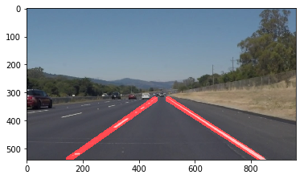

# **Finding Lane Lines on the Road** 

This is the first project of "Selef-Driving Car " Term1 . The goal of this project is to detect the lane on the road, and the lane would be color in red, just like following:

### 

The method to detect lane is quite simple. Followed by the concept from the course, I just used canny edge detect to get the edge in the road image,  then applied hough transform to recognize the line segment.

However, to detect whole lane (solid lines from image bottom to up) needs another effort. I will describe the more detail processes of this project.

---

### Reflection

### 1. Lane Detection Method

The pipeline of my lane detection method is:

- Set ROI

  I set the ROI area to trapezoid, which can ignore much unwanted edge.

  

- Blur image

  here, I used the same kernel_size = 5, to remove a small noise.

- Canny edge detection

  Just have the same threshold as example in the course.

  edge_low_threshold = 50
  edge_high_threshold = 150  

  I get the pretty good result:

  

  ​

  ​

- Hough line detection

  - detect left/right lane, and limit the range of the lane's slop

        right_slop_min = 0.5
        right_slop_max = 0.85
        left_slop_min = -0.85
        left_slop_max = -0.5
        for line in lines:
                slop = (line[0,1]-line[0,3])/(line[0,0]-line[0,2])
                if slop > 0:
                    if slop > right_slop_min and slop < right_slop_max:
                        right_lines.append(line)
                else:
                    if slop > left_slop_min and slop < left_slop_max:
                        left_lines.append(line)

  - Get the left/right lanes' function, by ployfit 

    as i have lines segment coordinate of left/right lanes, I can use this points to regress to have the lane function, like Y = AX  + B

        x_coord = []
        y_coord = []
        for i in range(len(left_lines)):
          x_coord.append(left_lines[i][0][0])
          x_coord.append(left_lines[i][0][2])
          y_coord.append(left_lines[i][0][1])
          y_coord.append(left_lines[i][0][3])
        #polyfit the lane
        left_lane_param = np.polyfit(x_coord,y_coord,1)
        #find the upper/lower point in the lane
        left_maxy = np.max(y_coord)
        left_miny = np.min(y_coord)
        
        x_coord = []
        y_coord = []
        for i in range(len(right_lines)):
          x_coord.append(right_lines[i][0][0])
          x_coord.append(right_lines[i][0][2])
          y_coord.append(right_lines[i][0][1])
          y_coord.append(right_lines[i][0][3])
        #polyfit the lane
        right_lane_param = np.polyfit(x_coord,y_coord,1)
        #find the upper/lower point in the lane
        right_maxy = np.max(y_coord)
        right_miny = np.min(y_coord)
    ​

  - Find the bottom and up  coordinate of the lanes

    because the one of the lanes is segment,  I used the long solid lane's max and min y coordinate to be two lane's bottom and up coordinate

        maxy = max(right_maxy,left_maxy)
        miny = min(right_miny,left_miny)

  - Calculate two end-point coordinate of the lanes.

        #get the end-point coordinate for left lane
        left_lower_x = max(np.int_((maxy-left_lane_param[1])/left_lane_param[0]),0)
        left_lower_y = (np.int_(left_lower_x*left_lane_param[0]+left_lane_param[1]))
        left_upper_x = min(np.int_((miny-left_lane_param[1])/left_lane_param[0]),width-1)
        left_upper_y = np.int_(left_upper_x*left_lane_param[0]+left_lane_param[1])
        left_lane_coord = [[[left_upper_x,left_upper_y,left_lower_x,left_lower_y]]]
        
        ##get the end-point coordinate for left lane
        right_lower_x = min(np.int_((maxy-right_lane_param[1])/right_lane_param[0]),width-1)
        right_lower_y = np.int_(right_lower_x*right_lane_param[0]+right_lane_param[1])
        right_upper_x = max(np.int_((miny-right_lane_param[1])/right_lane_param[0]),0)
        right_upper_y = np.int_(right_upper_x*right_lane_param[0]+right_lane_param[1])
        right_lane_coord = [[[right_upper_x,right_upper_y,right_lower_x,right_lower_y]]]

  - Draw the lane! 

        draw_lines(line_image, left_lane_coord,[255,0,0],20)
        draw_lines(line_image, right_lane_coord,[255,0,0],20)
        # Draw the lines on the edge image
        lines_edges = cv2.addWeighted(image, 0.8, line_image, 1, 0) `
    

### `2`. Potential shortcomings with  current pipeline

The potential shortcoming in this method, would happen when scene changed. Once ROI setting doesn't fit to the current parameters. There would be a lot of noise edge into detection area. 

However, this is the same as hough line detection and canny edge detection's parameters setting.

And I also have a lane's slop range, which are changed from camera lens, or camera angel. 

### 3. Suggest possible improvements to your pipeline

A possible improvement for algorithm's parameter setting, is to test more test images to have a robust set.

However, the cameras can also calibration by each user to  get the perfect ROI area to detect the lane. 

